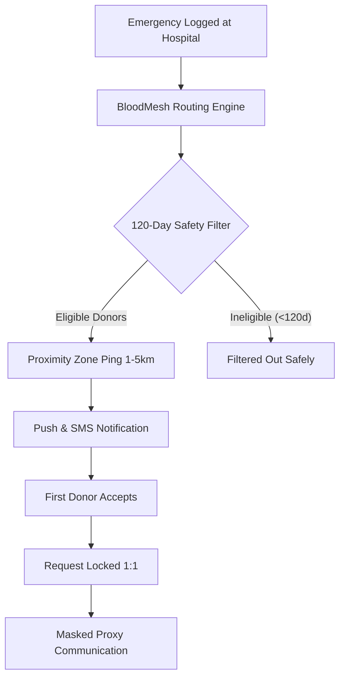

# BloodMesh 🩸

> **Automated, proximity-based emergency blood donor routing network** that algorithmically matches emergency blood requests with eligible local donors based on a 120-day donation rule and geographic zones.

---

## 🌟 Overview

During critical medical emergencies, every second counts. Traditional blood finding relies on chaotic manual phone trees, broadcast messaging spam, and unverified social media posts.

**BloodMesh** replaces this with an automated, zero-latency medical dispatch engine:
- **Sub-45s Dispatch**: Real-time algorithmic matching based on blood type compatibility and micro-geographic zones (1–5 km radius).
- **120-Day Medical Safety Rule**: Automatic enforcement of donor biological recovery cooldowns to prevent donor anemia and ensure high blood viability.
- **100% Privacy Shield**: Contact numbers remain strictly masked through secure proxy routing until a donor explicitly accepts.
- **1:1 Request Locking**: Prevents hospital crowding and duplicate responses.

---

## 🚀 Key Features

- **⚡ Emergency SOS Dispatcher**: Instantly broadcast urgent blood requests with unit specifications, urgency tiers, and hospital geo-fencing.
- **📡 Proximity Routing Radar**: Live visual simulation showing micro-zone search radiuses and real-time donor availability.
- **🩸 Active Requests Feed**: Real-time feed of active emergency alerts with live filtering by region and blood group.
- **⏱️ 120-Day Eligibility Calculator**: Interactive medical compliance tool allowing donors to verify their donation cooldown status.
- **📱 Fully Responsive**: Optimized for fast emergency access on smartphones, tablets, and desktop workstations.

---

## 🛠️ Tech Stack

- **Frontend**: [React 19](https://react.dev/) + [Vite](https://vitejs.dev/)
- **Styling**: [Tailwind CSS v4](https://tailwindcss.com/)
- **Icons**: [Lucide React](https://lucide.dev/)
- **Typography**: Plus Jakarta Sans

---

## 💻 Getting Started

### Prerequisites
- **Node.js**: `v18+` or `v20+`
- **npm** or **pnpm** / **yarn**

### Installation

```bash
# 1. Clone the repository
git clone https://github.com/efatahmed2005/BloodMesh.git
cd BloodMesh

# 2. Install dependencies
npm install

# 3. Start development server
npm run dev
```

The application will be running locally at `http://localhost:5173`.

### Production Build

```bash
npm run build
npm run preview
```

---

## 📋 Emergency Routing Protocol



---

## 📄 License

Built for emergency response. Open-source under the MIT License.
